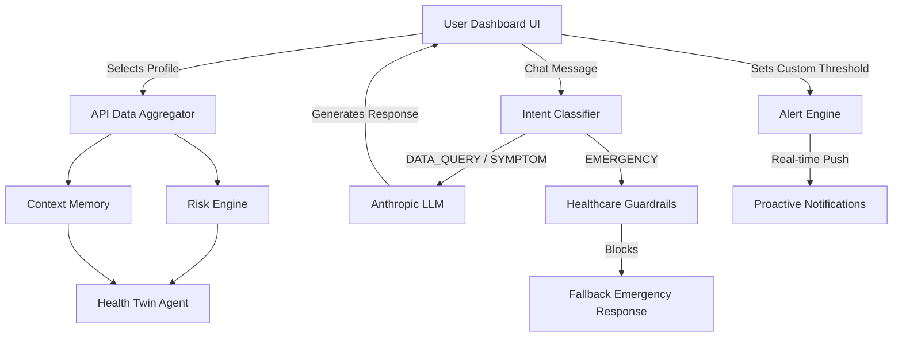

# 🩺 Proactive Health Copilot

Proactive Health Copilot is an AI-powered health dashboard that synthesizes user data from wearables, medical records, and lab results. It utilizes advanced agentic workflows with Anthropic's **Claude Sonnet 4.5** to infer health states, classify user intents, and proactively alert users to potential health events before they escalate.

---

## 🏗 Architecture & Systems Thinking
*How we reason about the architecture and tradeoffs.*

The architecture is built as a highly robust and defensive Next.js application. We utilize a pipeline architecture where hard algorithmic engines preprocess data before handing it to the AI for conversational synthesis.



**Tradeoffs & Decisions:**
- **Modular vs Monolithic AI:** Instead of passing raw physiological data to a single massive prompt, we use algorithmic pipelines (`riskEngine`, `contextMemory`). This deterministic preprocessing lowers latency, reduces token costs, and strictly bounds hallucination risks. The LLM is used strictly for *empathy and synthesis*.
- **Defensive API Design:** We implemented an active fallback mechanism around the Anthropic API. If the API key is unprovisioned, expired, or hits a proxy blocker (e.g., `401 Invalid Token` or `404 model_not_found`), the system gracefully intercepts the error and routes the user through a local heuristic fallback engine, ensuring the React UI never crashes.
- **Client vs Server State:** Agentic data processing (and API keys) remain completely sandboxed in Next.js Server API routes. The client strictly handles interactive UI state.

## 🧠 Agentic Reasoning
*How the system decides and acts on the user's behalf.*

- **Intent Classification Pipeline:** When a user interacts with the Copilot Chatbot, their text is intercepted by an `intentClassifier`. The message is autonomously categorized into `DATA_QUERY`, `SYMPTOM_LOGGING`, `GENERAL_ADVICE`, or `EMERGENCY`.
- **Dynamic Context Injection:** Based on the classified intent, the agent autonomously decides *what* data to pull. If it's a `DATA_QUERY`, it pulls the user's exact resting heart rate and sleep efficiency from the `contextMemory` before formulating a prompt.
- **Context-Aware Memory Management:** The React frontend utilizes strict Component Keying (`key={selectedUser}`). This forces the agent to completely obliterate its conversation history and reconstruct its prompt logic whenever a new patient profile is loaded, guaranteeing zero cross-contamination of patient data.

## 🎯 Product Sense
*What we chose to build, and why.*

**Problem:** Existing health apps display charts but require users to act as their own doctors to interpret what the data means.
**Solution:** We built a *Proactive Copilot*. It shifts the paradigm from retroactive reporting ("You slept 5 hours") to proactive intelligence ("Your recovery debt is high; let's adjust your activity today").

**Key Features:**
1. **Conversational Copilot:** A floating chatbot that translates complex physiological data into plain English. It supports rich-text formatting (Markdown) for highly readable coaching.
2. **Custom Threshold Alerts:** Users can define explicit alert triggers (e.g., "Alert me if Heart Rate > 80"). This bridges the gap between passive monitoring and active user control.
3. **Proactive Notifications:** A toast notification engine that actively interrupts the UI to warn users of `CRITICAL` or `WARNING` state changes (e.g., "Cardio Stress Pattern Detected").

## 🛡 Healthcare Guardrails
*Ensuring safety in an AI medical context.*

Because this operates in a simulated healthcare environment, three hardcoded guardrails are executed prior to any LLM generation:
1. **Emergency Escalation (Hard Block):** If a user mentions keywords related to suicide, heart attacks, or extreme distress, the request is instantly hijacked and an emergency response ("Call 911") is returned.
2. **Anti-Diagnosis Enforcement:** Prevents the AI from legally compromising the system by explicitly blocking diagnostic requests or medication prescriptions.
3. **PII/PHI Anonymization:** Scans and strips extreme identifiers (like SSNs) via regex before the payload ever reaches the LLM network.

## 🚀 Implementation Summary
*What actually works.*

- **Fully functional Next.js Dashboard:** Built with Tailwind CSS and `lucide-react`.
- **Model Migration:** Updated strictly to `claude-sonnet-4-5-20250929` to comply with the 2026 deprecation of Claude 2 and 3 legacy models.
- **Defensive Handling:** Try/Catch fallbacks for API `401/404` errors using deterministic string heuristic routing.
- **Rich Text Chat:** Integrated `react-markdown` for beautiful typography rendering inside the Copilot.

## 🤖 AI Fluency
*How AI tools were natively used to supercharge work.*

- **Rapid Prototyping:** Leveraged LLMs for fast iteration on Recharts components and UI logic.
- **Complex Debugging:** Used AI agent capabilities to rapidly diagnose model deprecation API errors (`404 not_found_error`) and Chinese proxy auth blockers (`[ant]无效的令牌`), designing robust architectural fallbacks in minutes.
- **Git & Deployment Operations:** Utilized AI to seamlessly execute terminal commands for `gh` authentication, repo initialization, and commit management without breaking context flow.

---

## 💻 Getting Started

First, install dependencies:

```bash
npm install
# Note: Requires Node 20.9.0+ due to Next.js 15+ constraints
```

Set up your environment variables by creating a `.env.local` file:

```env
# Official Anthropic API Key
ANTHROPIC_API_KEY=your-anthropic-api-key

# Do NOT use a BASE_URL proxy if utilizing an official Anthropic API key.
# ANTHROPIC_BASE_URL=https://api.apiyi.com
```

Run the development server:

```bash
npm run dev
```

Open [http://localhost:3000](http://localhost:3000) with your browser to view the dashboard and interact with the Copilot!
